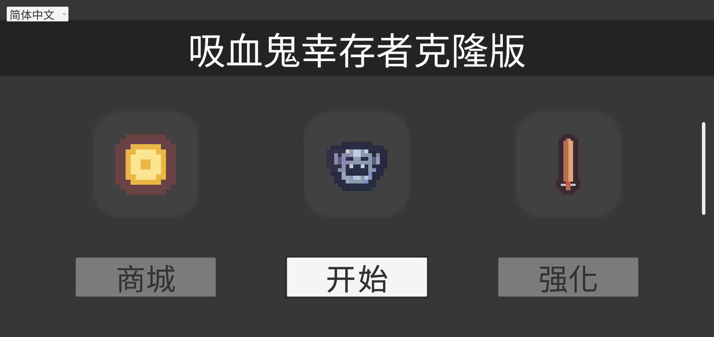
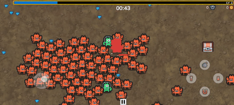
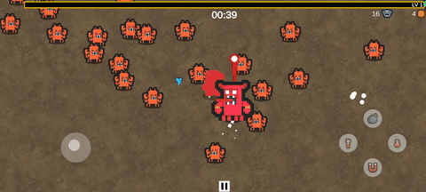

<div align="center">

# Unity APK 逆向入门

**动手扒开一个 Unity 手游 —— 把里面的 C# / Lua / 资源 / Java 一层层读出来。**

零基础也能跟着做：每章都有可运行的演示 + 自动批改的作业，做对点亮、像爬塔一样通关。



<sub>课程用一个自制的 Unity 手游「吸血鬼幸存者克隆版」当靶子 —— 你会把它装上真机，再解开它的每一层。</sub>

</div>

## 🎮 同一场战斗，改一个数值前后

| 破解前 · 小怪吃 0 伤害，砍不动 | 破解后 · 一刀一个，秒杀 |
|:---:|:---:|
|  |  |

<div align="center"><sub>解开脚本层、把伤害/无敌开关的数值改掉、重打包，同一个游戏的战斗就完全不一样了。</sub></div>

---

## ✨ 你会学到

- **拆解 Unity APK 的五层结构** —— 认清 native / C# / 脚本 / 资源 / Java 各在哪
- **把游戏装上真机** —— 用 adb 上手一个真实的 Unity 手游
- **读出 C#** —— 从 il2cpp metadata 里挖出字符串、看类骨架
- **解出 Lua** —— 识别 Lua 的多种形态，XOR 爆破解出脚本
- **反编译 DEX** —— jadx 把 `classes.dex` 还原成可读 Java
- **提取资源** —— 从 AssetBundle 导出贴图

## 🚀 快速开始

去 [**Releases**](../../releases) 下最新包，解开后：

```
server.exe            ← 双击启动（本地课程加载器）
mods/course/          ← 课程内容
```

双击 `server.exe`，浏览器打开 **http://127.0.0.1:8770/** —— 看课、跑演示、交作业批改，全在网页里闭环，不用开终端。

## 📚 课程内容（8 章）

| 段 | 章 | 学到 |
|---|---|---|
| 🧱 地基 | 环境准备 · 工具清单 | 装齐 adb / python / UnityPy / java / jadx |
| 📦 APK 入门 | APK 五层结构 | 认清 Unity APK 的五层 |
| | 装游戏到真机 | 把靶子游戏装上手机、跑起来 |
| 🔍 读懂各层 | C# 出骨架 | 从 il2cpp metadata 读出字符串 |
| | Lua 认形态 | 识别 Lua 形态，XOR 爆破解出脚本 |
| | DEX 反编译 | jadx 把 `classes.dex` 还原成 Java |
| | 资源提取 | 从 AssetBundle 导出贴图 |

## 🛠 项目结构

| 目录 | 是什么 |
|---|---|
| `builder/` | 通用编译器：把课程目录编译成可加载的 mod 包 |
| `loader/` | 通用运行时：HTTP server + 内嵌网页 UI，`cd loader && go build` 即得 |
| `course/` | 课程内容：讲义、作业题面、靶包材料、塔定义 `maps/` |

> 仓库里只放源码与内容；编译产物（批改器、演示程序、靶包、工具）不进 git。
> **可直接运行的完整课程包在 [Releases](../../releases) 下载。**

## 📄 License

课程内容仅供学习与授权测试使用。
